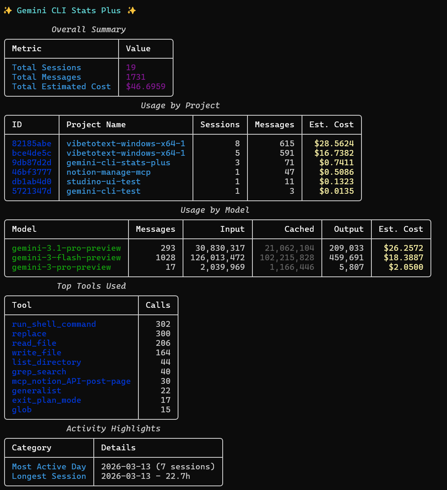

<p align="left">
  
</p>

# Gemini CLI Stats Plus



A powerful usage and cost analyzer for the [Gemini CLI](https://github.com/google/gemini-cli).

## Features

- **Overall Summary**: Total sessions, messages, and estimated cost.
- **Usage by Project**: Detailed breakdown of sessions, messages, and cost per project, with support for project name resolution.
- **Usage by Model**: Breakdown of token counts (Input, Output, Cached) and cost per model.
- **Top Tools Used**: List of the most frequently used CLI tools.
- **Activity Highlights**: Identification of your most active day and longest session.

## Installation

```bash
pip install rich
```

## Usage

Run the script from your terminal:

```bash
python gemini_stats.py
```

By default, it looks for session data in `~/.gemini`. You can specify a custom path using the `--path` or `-p` argument:

```bash
python gemini_stats.py --path /path/to/your/.gemini
```

## Programmatic Usage

You can import `gemini_stats` into your own Python scripts or orchestration tools:

```python
import gemini_stats

# Run analysis in silent mode
stats = gemini_stats.analyze(base_dir="~/.gemini", silent=True)

if stats:
    print(f"Total Sessions: {stats['total_sessions']}")
    print(f"Total Messages: {stats['total_messages']}")
    print(f"Total Cost: ${stats['total_cost']:.4f}")
```

### Agent Handshake
If you are building an AI agent or orchestrator, you can use the built-in guide:

```python
print(gemini_stats.get_agent_guide())
```

## Security

This tool only reads local session metadata and contains no API keys or secrets. It is safe to use and share.
